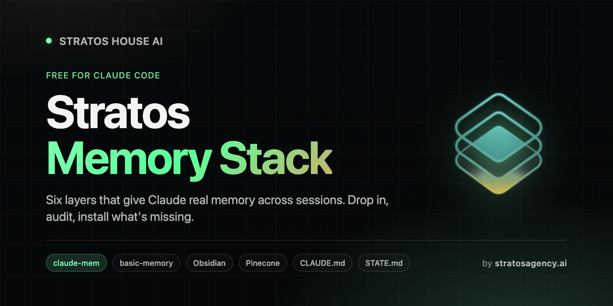

<div align="center">
  
</div>

<h1 align="center">Stratos Memory Stack</h1>

<p align="center">
  <strong>Memory that learns and keeps itself current.</strong><br/>
  Six layers that remember. A learning loop that keeps it sharp. Drop in. Audit. Install what's missing.
</p>

<p align="center">
  <a href="#install"></a>
  <a href="#the-learning-loop"></a>
  <a href="LICENSE"></a>
  <a href="https://www.stratosagency.ai"></a>
</p>

---

## What this is

A free Claude Code plugin in two halves.

**The memory half (six layers).** Install it, run the skill, and Claude will:

1. **Audit** your machine. Check which of the six layers you already have.
2. **Report** a clean status table (`INSTALLED` / `PARTIAL` / `MISSING` per layer).
3. **Install** the missing pieces one at a time, with your confirmation.

You end up with a stack that means you never re-explain a project, never lose a decision, and never re-read a 40-page doc to find one number.

**The learning half (a nightly loop).** Memory remembers. Learning changes behavior. The loop captures the rules you teach Claude in passing, scouts the web every night for new tools that fit you, and ranks them into a daily board of opportunities. Your brain stops being a notebook and starts being a nervous system. [Jump to the learning loop](#the-learning-loop).

## The six layers

| # | Layer | What it does |
|---|---|---|
| 1 | **[claude-mem](https://github.com/thedotmack/claude-mem)** | Auto-captures every session, auto-injects relevant past context next session. |
| 2 | **[basic-memory](https://github.com/basicmachines-co/basic-memory)** | Semantic search over your whole knowledge vault, exposed as MCP tools. |
| 3 | **[Obsidian](https://obsidian.md)** | Local markdown notes. The source of truth everything else points at. |
| 4 | **[Pinecone](https://www.pinecone.io)** | Vector archive of immutable raw docs for fast quoting without re-reading. |
| 5 | **`CLAUDE.md` + `MEMORY.md`** | Rules and priorities Claude Code auto-loads every session. |
| 6 | **`STATE.md` per project** | Per-project resume file with verbatim handoff summary. |

Four are tools you install. Two are file patterns you adopt. All six talk to each other.

## How they connect

```
                  IMMUTABLE
        ┌─ Pinecone (raw archives, semantic search) ─┐
            ┌── Obsidian vault (living notes, you write) ──┐
                ┌── basic-memory (vault index, MCP search) ──┐
                    ┌── claude-mem (session capture + replay) ──┐
                        ┌── CLAUDE.md / MEMORY.md (rules) ──┐
                            ┌── STATE.md (active resume) ──┐
                                EPHEMERAL / CURATED
```

The spine is Obsidian. Every other layer is a lens on it.

- `basic-memory` indexes the vault for semantic search.
- `claude-mem` captures what you do *with* the vault.
- `Pinecone` archives a frozen slice for fast quoting.
- `CLAUDE.md`, `MEMORY.md`, and `STATE.md` are pointers *into* the vault that load at the right time.

Full architecture writeup: [`docs/architecture.md`](docs/architecture.md).

## The learning loop

The six layers above are the **recall** half. They remember perfectly, but they never get smarter on their own, and they do not know what shipped in the world this week. The learning loop is the **write-back** half. Four small organs, running nightly, that turn your brain from a notebook into a nervous system.

```
        +-----------------------------------------------+
        |                                               v
   (1) CAPTURE --> (2) CONSOLIDATION --> rules / skills
   SessionEnd hook    promote repeated                  |
   writes the rules   lessons, flag stale facts         | feeds judgment
   you say out loud   (a digest you approve)            v
        ^                                         (4) CONDUCTOR --> your channel
        |                                         ranks the radar into     + a board
        | your accept / dismiss                   a daily board of missions
        | is training data                              ^
        +----------------------------------------------+
                                                        |
   (3) SCOUTS: nightly, per department, diff your        |
       sources and append only what is new --------------+
```

| Organ | What it does |
|---|---|
| **Capture** | A `SessionEnd` hook records the rules you say in passing ("from now on, always...") before they are lost. |
| **Consolidation** | Nightly, it promotes a pattern that recurs 2-3 times into an enforced rule, and flags stale facts. It writes a digest you approve; it never edits rules on its own. |
| **Scouts** | Nightly, one scout per department web-searches your sources for genuinely new tools, models, and libraries that fit your stack, and files them to a tool-radar. Silent when nothing changed. |
| **Conductor** | Nightly, it ranks the radar into a short board of opportunities, by weights you set, and delivers the top few to a channel you choose. |

**It runs for free.** The nightly engines run on GitHub Actions. Your vault is already a git repo, so "check out, run `claude -p`, commit back" is the platform's native motion. The only cost is the Anthropic tokens per run, capped with `--max-budget-usd`. A realistic bill is a few dollars a month. No new server, no new database, markdown and git all the way down, so every change the brain makes to itself is a commit you can read and revert.

**The loop closes.** The Conductor shows you missions. You accept, snooze, or dismiss. That reaction becomes capture, and over weeks the Conductor learns which missions you actually act on. It evolves its judgment about *you*, not just its config.

Full pattern, engine routines, ready-to-use workflows, and the profile that personalizes it: **[`learning/`](learning/)**.

## Mode Activators

Once you have more than one active project stream in your vault, claude-mem will start picking the wrong one. The last session you ran was Portal shipping work. This morning you sit down to do strategy work and type `BRAIN ONLINE`. claude-mem auto-injects the Portal handoff because it was most recent, and Claude opens with "ready to verify the portal deploy?" You wanted a strategy pulse.

That is the wrong-stream problem. The fix is small. A `UserPromptSubmit` hook scans your prompt for ONLINE-suffix phrases and prepends a strong directive to the system reminder. The directive tells Claude which files to load for the requested mode, and explicitly tells it to suppress the auto-injected context from any other stream.

You type the phrase. The hook fires before Claude reads the auto-injection. The mode wins.

Define your own modes. The shape is `<NAME> ONLINE` (or any phrase you want to anchor on). A few illustrative examples to copy and adapt:

| Phrase | Loads | Suppresses |
|---|---|---|
| `STRATEGY ONLINE` | your strategy playbook, current backlog | client-delivery + ops streams |
| `CLIENT-A ONLINE` | `projects/client-a/STATE.md`, latest client-a handoff | all other client streams |
| `PRODUCT ONLINE` | `product/STATE.md`, latest sprint notes | non-product streams |

Replace `STRATEGY` / `CLIENT-A` / `PRODUCT` with the names of your actual streams. The pattern is what matters, not the labels.

The hook only adds the activator block when a phrase matches. Normal prompts are untouched. Adding a new mode is a five-line edit.

Full pattern, reference hook, and limitations: [`docs/mode-activators.md`](docs/mode-activators.md).

## Install

In Claude Code:

```text
/plugin marketplace add ArshiaEcho/stratos-memory-stack
/plugin install stratos-memory-stack@stratos
```

Then trigger the skill:

```text
/stratos-memory-stack
```

Claude will run the audit and walk you through installing what's missing. To add the nightly learning loop after your memory layers are in place, follow [`learning/README.md`](learning/README.md).

## What the audit looks like

```
| # | Layer                  | Status     | Notes                                  |
|---|------------------------|------------|----------------------------------------|
| 1 | claude-mem             | INSTALLED  | v13.3.0, enabled                       |
| 2 | basic-memory           | MISSING    | No MCP config found                    |
| 3 | Obsidian               | PARTIAL    | Vault at ~/notes, no projects/ folder  |
| 4 | Pinecone (optional)    | MISSING    | Skip unless user has raw archives      |
| 5 | CLAUDE.md / MEMORY.md  | INSTALLED  | 90 lines, covers all sections          |
| 6 | STATE.md               | PARTIAL    | 2 files found, neither has 🚨 block    |
```

Followed by: "You're missing X, Y, Z. Want to start with [recommended next layer]?"

## Manual setup (without the skill)

If you want to read through everything before letting Claude touch your machine:

- [`docs/01-obsidian-setup.md`](docs/01-obsidian-setup.md) - Obsidian + vault structure
- [`docs/02-claude-mem-setup.md`](docs/02-claude-mem-setup.md) - claude-mem install
- [`docs/03-basic-memory-setup.md`](docs/03-basic-memory-setup.md) - basic-memory MCP
- [`docs/04-pinecone-setup.md`](docs/04-pinecone-setup.md) - Pinecone (optional)
- [`docs/05-file-conventions.md`](docs/05-file-conventions.md) - CLAUDE.md, MEMORY.md, STATE.md
- [`docs/06-learning-loop.md`](docs/06-learning-loop.md) - the nightly learning loop (capture, consolidate, scouts, conductor)
- [`docs/mode-activators.md`](docs/mode-activators.md) - Mode Activators hook for multi-stream vaults (optional)
- [`docs/architecture.md`](docs/architecture.md) - How it all fits together

Templates to copy:

- [`templates/CLAUDE.md.template`](templates/CLAUDE.md.template)
- [`templates/MEMORY.md.template`](templates/MEMORY.md.template)
- [`templates/STATE.md.template`](templates/STATE.md.template)
- [`templates/pinecone_ingest.py`](templates/pinecone_ingest.py)
- [`templates/pinecone_query.py`](templates/pinecone_query.py)
- [`templates/mode-activator-hook.sh.template`](templates/mode-activator-hook.sh.template) - starter `UserPromptSubmit` hook with 2 example modes
- [`learning/`](learning/) - the full learning loop: hook, engine routines, workflows, profile

## Recommended install order

If you're starting from zero, do it in this order:

1. **Obsidian** + vault structure (foundation)
2. **`CLAUDE.md`** (rules)
3. **`STATE.md`** for one active project (immediate value)
4. **`claude-mem`** (auto session capture)
5. **`basic-memory`** (vault search)
6. **`Pinecone`** (only if you have raw archives)
7. **The learning loop** (once the memory layers are stable, add the nightly capture + scouts + conductor)

Total time to a working memory stack: about 2 hours, spread across a week as you actually need each piece. The learning loop is another hour once you are ready. The skill walks you through each step.

## Why this stack

Most "AI memory" setups pick one tool and try to make it do everything. They all hit the same wall: a vector DB is bad at rules, a rules file is bad at search, a session log is bad at archives.

This stack works because **every layer has a different write authority and a different recall mechanism**, so they don't fight each other.

- Obsidian for living notes you write.
- Pinecone for frozen archives you only read.
- `STATE.md` for active resume state.
- `MEMORY.md` for never-forget rules.
- `claude-mem` for "what did past me decide?"
- `basic-memory` for the search layer that ties it all together.

And then the learning loop sits on top, so the whole thing does not just remember, it gets sharper and keeps itself current. No layer tries to be the whole brain. Each one does one job well.

## A typical day, end to end

1. Open Claude Code in your vault. `claude-mem` auto-injects relevant past context.
2. Claude auto-loads `CLAUDE.md` and `MEMORY.md`. You say a trigger word; it reads the right `STATE.md` and prints the handoff.
3. You work. Claude searches via `basic-memory`, quotes from `Pinecone`, and when you say "from now on, always..." the **capture** hook quietly records it.
4. End of session: `STATE.md` and `claude-mem` update. The capture buffer holds today's lessons.
5. Overnight, on their own: the **scouts** find what shipped in your field, the **conductor** ranks it into a board, and **consolidation** proposes which of your repeated lessons should become permanent rules.
6. Morning: you open a short list of opportunities instead of a firehose of news. No file-hunting, no re-explaining, and nothing about your field got past you.

## Credits

This stack is built on the work of others. The Stratos Memory Stack just opinionates a path through them.

- [claude-mem](https://github.com/thedotmack/claude-mem) by Alex Newman ([@thedotmack](https://github.com/thedotmack))
- [basic-memory](https://github.com/basicmachines-co/basic-memory) by [Basic Machines](https://basicmemory.com)
- [Obsidian](https://obsidian.md) by Dynalist Inc.
- [Pinecone](https://www.pinecone.io)
- The Karpathy LLM Wiki pattern (`knowledge/raw/` + `knowledge/wiki/`)

The learning loop draws on the self-improving-agent patterns documented across the field in 2025-26: auto-logging capture, Reflexion-style post-mortems, recurrence-gated promotion, and silent-unless-changed scheduled watchers.

## Share this

If you found this useful, send it to someone else who uses Claude Code. Keep the title "Stratos Memory Stack" so they can find updates.

Compiled by **Stratos House AI** (Arshia Navabi). MIT licensed. Free forever.

If you build on top of this stack and ship something cool, I want to hear about it. Find me at [stratosagency.ai](https://www.stratosagency.ai) or open an issue here.

---

<div align="center">
  <sub>
    <a href="https://www.stratosagency.ai">stratosagency.ai</a>
    &nbsp;·&nbsp;
    <a href="https://github.com/ArshiaEcho/stratos-memory-stack">repo</a>
    &nbsp;·&nbsp;
    <a href="https://github.com/ArshiaEcho/stratos-memory-stack/issues">issues</a>
  </sub>
</div>
